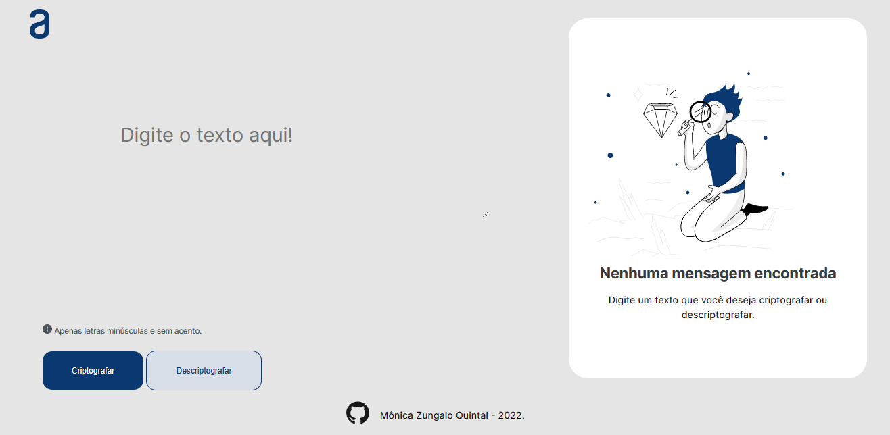

# Challenge ONE | Decodificador de texto
Lógica de Programação

## Atividade proposta:

Boas vindas ao primeiro desafio! Durante estas duas semanas, vamos trabalhar em uma aplicação que criptografa textos, assim você poderá trocar mensagens secretas com outras pessoas que saibam o segredo da criptografia utilizada.

~~~
As "chaves" de criptografia que utilizaremos são:
  A letra "e" é convertida para "enter"
  A letra "i" é convertida para "imes"
  A letra "a" é convertida para "ai"
  A letra "o" é convertida para "ober"
  A letra "u" é convertida para "ufat"
~~~

Requisitos:
- Deve funcionar apenas com letras minúsculas
- Não devem ser utilizados letras com acentos nem caracteres especiais
- Deve ser possível converter uma palavra para a versão criptografada e também retornar uma palavra criptografada para a versão original.
- A página deve ter campos para inserção do texto a ser criptografado ou descriptografado, e a pessoa usuária deve poder escolher entre as duas opções
- O resultado deve ser exibido na tela.

Extras:

Um botão que copie o texto criptografado/descriptografado para a área de transferência - ou seja, que tenha a mesma funcionalidade do ctrl+C ou da opção "copiar" do menu dos aplicativos.

[Link para o Trello!](https://trello.com/b/EmUFmjCv/decodificador-de-texto-alura-challenges-oracle-one)

## O projeto:

[Link para o Figma](https://www.figma.com/file/tvFEYhVfZTjdJ5P24RGV21/Alura-Challenge---Desafio-1---L%C3%B3gica?node-id=16%3A802&t=ztgwDhWs8pabnFKr-0)

## Mensagem secreta:

> "pairaibenterns poberr enterncairair enterssenter dentersaifimesober enter tenterr fimesnailimeszaidober enterlenter coberm sufatcenterssober!"

Ou seja: parabens por encarar esse desafio e ter finalizado ele com sucesso! 🎉

## Entrega do desafio:

- [X] Subir o projeto para o GitHub;

- [X] Publicar no GitHub Pages;

- [X] Adicionar a #challengeonedecodificador4;

- [X] Preencher o formulário de envio https://lp.alura.com.br/alura-latam-entrega-challenge-one-portugues com o link do GitHub Pages (projeto publicado);

- [X] Verifique seu e-mail e receba seu selo;

- [ ] Poste um vídeo e/ou seu projeto no Linkedin.